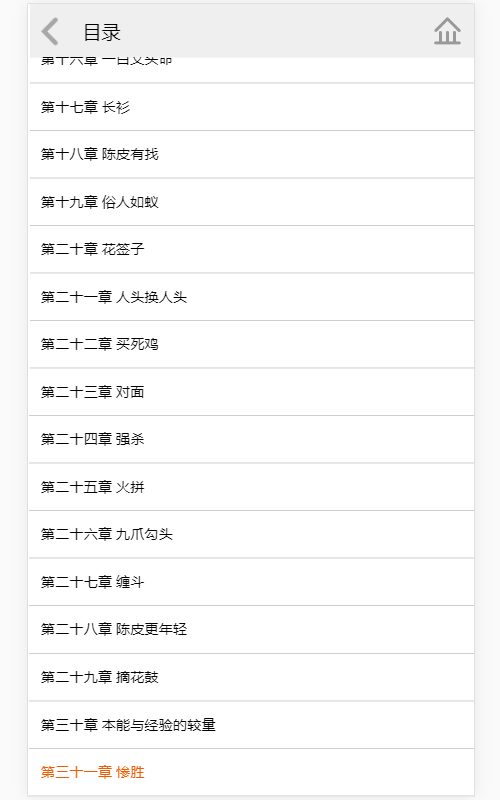
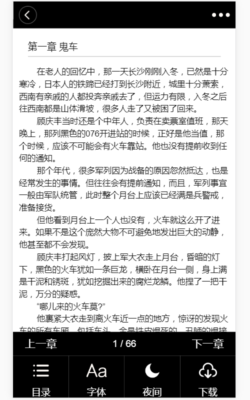
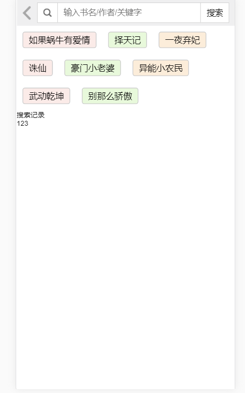

> 项目介绍
```
小米书城中文网其前身为小米书城原创文学协会（Chinese Magic Fantasy Union），是国内文学阅读与写作平台之一，也是国内原创文学门户网站，创立于2002年5月，隶属于国内数字内容综合平台——阅文集团旗下。小米书城网已经形成了完善的创作、培养、销售为一体的电子在线出版机制，并得以向文化产业全面延伸。网站作品内容多元，其中有玄幻、武侠、都市、历史、军事、游戏、竞技、灵异、科幻等小说题材。

在2003年10月以此为契机开创了在线收费阅读即电子出版的模式。“小米书城乐读”是阅文文学•小米书城中文网于2010年重磅推出的出版品牌。
```
>技术栈
```
gulp+require+handlebars+zepto+jquery
```
>项目运行方式
```
    gulp i -D
    gulp
```


>目录结构
```
|——bulit
|   |——css
|   |   |——catalog.css
|   |   |——common.css
|   |   |——detail.css
|   |   |——login.css
|   |   |——read.css
|   |   |——seek.css
|   |   |——style.css
|   |   |——swiper-4.2.2.min.css
|   |——img
|   |   |——@EaSXPML.png
|   |   |——0wcW9@C9.png
|   |   |——3o66jDFr.png
|   |   |——kgwIyM3V.png
|   |   |——sZwk5ja6.png
|   |   |——vEo70Tka.png
|   |   |——x0D0GrWs.png
|   |——js
|   |   |——main.js
|   |   |——app
|   |   |   |——catalog.js
|   |   |   |——detail.js
|   |   |   |——index.js
|   |   |   |——login.js
|   |   |   |——read.js
|   |   |   |——seek.js
|   |   |——lib
|   |   |   |——flexible.js
|   |   |   |——handlebars-v4.0.11.js
|   |   |   |——jquery.base64.js
|   |   |   |——jquery.lazyload.js
|   |   |   |——jquery.min.js
|   |   |   |——require.js
|   |   |   |——require.text.js
|   |   |   |——swiper-4.2.2.min.js
|   |   |   |——zepto.js
|   |   |——mail
|   |   |   |——getUrl.js
|   |   |——page
|   |   |   |——catalog.html
|   |   |   |——detail.html
|   |   |   |——login.html
|   |   |   |——read.html
|   |   |   |——seek.html
|   |   |——template
|   |   |   |——Bestseller.html
|   |   |   |——bookrack.html
|   |   |   |——catalog.html
|   |   |   |——detail.html
|   |   |   |——handpick.html
|   |   |   |——index.html
|   |   |   |——love.html
|   |   |   |——read.html
|   |   |   |——recommend.html
|   |   |   |——searchKey.html
|   |   |——index.html
|——mocce
|   |——data
|   |   |——352876.json
|   |   |——chapter-list.json
|   |   |——data1.json
|   |   |——data2.json
|   |   |——data3.json
|   |   |——data4.json
|   |   |——home.json
|   |   |——recommend1.json
|   |   |——recommend2.json
|   |   |——recommend3.json
|   |   |——search.json
|   |   |——searchKey.json
|   |——login
|   |   |——login.json
|   |——data.js
|——src
|   |——01.png
|   |——02.png
|   |——03.png
|   |——04.png
|   |——05.png
|   |——06.png
|   |——07.png
|——gulpfile.js
```
>部分截图
---






---